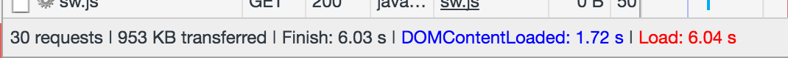
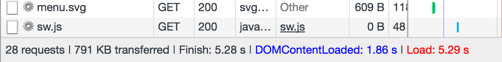
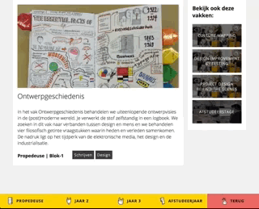
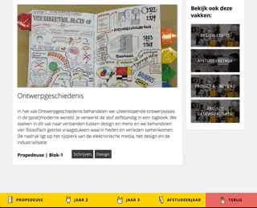
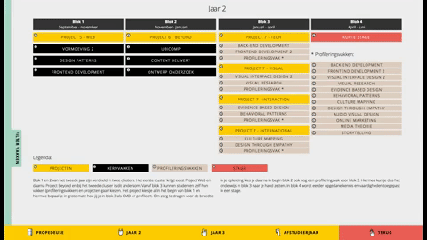

# CMD Touch
Repository for the end assignment of the minor Web Development at the University of Applied Sciences. This repository has a [code guideline](/code-styleguide.md), which should be followed.

## Index
1. [Case](#case)
2. [KeystoneJS](#keystonejs)
3. [Web App From Scratch](#web-app-from-scratch)
4. [CSS to the Rescue](#css-to-the-rescue)
5. [Performance Matters](#performance-matters)
6. [Browser Technology](#browser-technology)
7. [Filter by course type](#filter-by-course-type)
8. [Models](#models)
9. [Handlebars](#handlebars)
10. [MOSCOW](#moscow)
11. [Dependencies](#dependencies)
12. [Install](#install)
13. [Wishlist](#wishlist)
## Live link
http://cmd-touch.herokuapp.com/

## Link to CMS 
http://cmd-touch.herokuapp.com/keystone


## [Case](#case)
The open days of the study Communication & Multimedia Design (CMD) at the University of Applied Sciences Amsterdam are meant to give students insight into what the study entails and what they can expect. A notable addition to the open day is the large touchscreen where students can view the curriculum on. Multitouch gestures, however, are not well supported on the touchscreen, making it almost impossible to scroll. Tapping however works very well and is a fun, interactive way for people to get a clear overview of what CMD has to offer. The challenge I took on was making the website easily navigatable, inviting to look at, informative and easy to maintain for the administrator. 

## [KeystoneJS](#keystonejs)
To tackle the challenge of making the website easy to maintain for the administrator the first logical step was to find a suitable content management system (CMS). I researched a couple different CMSs before settling on Keystone.js. 
KeystoneJS is a database driven CMS that uses MongoDB, I have worked with MongoDB before and really liked the clear syntax of it. I chose Keystone above a CMS like Wordpress because it's completely written in Javascript and easy to customize to your own preferences. It uses MongoDB's models and has a lot of predefined types that you can use to make your text fields. 

## [Web App From Scratch](#web-app-from-scratch)
This website has a [code guideline](/code-styleguide.md) to make sure all code is comprehensible and follows the same structure.

## [CSS to the Rescue](#css-to-the-rescue)
I used the relatively new CSS Grid layout for most elements. CSS Grid is very responsive and doesn't need a lot of code lines. To make sure older browsers are also supported I used CSS flexbox.

## [Performance Matters](#performance-matters)

### Service Worker
If the internet disconnects suddenly at an open day the website uses a service worker to load the pages that have already been viewed from cache. The service worker also helps to load pages faster, especially those with images, here is a visual before and after of the loading time on Good 3G network speed:


Without service worker:

 

With service worker:


And here it is in actual numbers on Good 3G network speed:
Without service worker:

 

With service worker:


### Node-minify
I used the NPM module `node-minify` to minify my CSS and JS files. Node-minify takes your normal css/js file and uses it to make a new file with the minified code.

Everything is tested on 'Good 3G' speed of Google Chrome's Developer tools to give a more accurate audit.

Without Minify:

 


With Minify:

 

And here it is in actual numbers on Good 3G network speed:

Without minify:

 

With Minify:

 

## Skeleton Loading
To avoid content jumping down when images are loaded I added skeleton loading.

Without skeleton loading:

 


With skeleton loading:

 


## [Browser Technology](#browser-technology)
I have optimized this website for all browsers that at least support Flexbox. The touchscreen that is used at the open day is connected to a laptop, the website should be opened in a browser that at least supports Flexbox. For an even better experience the website should be opened in a browser that supports CSS Grid. The website is also accessible outside the open days, but it should be expected from a potential student that wishes to study CMD that they use a modern browser. Also; most browsers have supported Flexbox since 2014.

## [Filter by course type](#filter-by-course-type)
Users are able to filter the courses by types. Types can be added and removed and one or more can be assigned to a course in the CMS.

 
If a course-type doesn't exist on the page it gets a class `hide`.

```javascript
filters.forEach(function(f) {
// if there is no element with the selected class it gets hidden:
  if (document.querySelectorAll('.' + f.id).length == 0) {
    document.getElementById(f.id).classList.add('hide');
  }
  document.getElementById(f.id).addEventListener('click', function(e) {
    filters.forEach(function(fe) {
      document.getElementById(fe.id).classList.remove('filter-clicked');
    })
    document.getElementById(e.target.id).classList.add('filter-clicked');

    document.querySelectorAll('.course').forEach(function(vak) {
      vak.classList.remove('spotlight');
    })
    document.querySelectorAll('.' + this.id).forEach(function(vak) {
      vak.classList.add('spotlight');
    })
  })
})
```


## [Models](#models)
Keystone works with models, the models are declared in the folder `/models` and look like this:
```javascript
var keystone = require('keystone');
var Types = keystone.Field.Types; // import keystones field types

// Make a new keystone list
var Course = new keystone.List('Course', { 
  map: {name: 'title'},
  singular: 'course',
  plural: 'courses',
  autokey: {path: 'slug', from: 'title', unique: true}
});

// Add the fields you want to use:
Course.add({
  title: {type: String, required: true},
  image: {type: Types.CloudinaryImage},
  embeddedVideo: {type: Types.Html, wysiwyg: false, height: 40},
  description: {type: Types.Html, wysiwyg: false, height: 400},
  type: {type: Types.Select, options: 'project, vak, stage, profilering', default: 'vak'},
  year: {type: Types.Select, options: 'propedeuse, jaar-2, jaar-3, afstudeerjaar', default: 'propedeuse'},
  blok: {type: Types.Select, options: 'blok-1, blok-2, blok-3, blok-4, semester-1, semester-2', default: 'blok-1'},
  courseType: {type: Types.Relationship, label: 'Course type', ref: 'CourseType', many: true},
  connectedCourses: {type: Types.Relationship, label: 'Connected Courses', ref: 'Course', many: true}
});

// Register the new model to the backend
Course.register(); 
```
Keystone has a lot of [predefined types](http://keystonejs.com/docs/database/#fieldtypes).

To be able to use the data that was entered in the CMS by an administrator on the client side, a new view file has to be created in the folder `routes/views`.
```javascript
var keystone = require('keystone');

// this makes models available in this file
exports = module.exports = function(req, res) { 
  var view = new keystone.View(req,res);
	// All queries are saved in locals and usable on the client side
  var locals = res.locals;

  // view.query is used to find the model 'Curriculum', it is accessible on the client side with the query 'curriculum'.
  view.query('curriculum', keystone.list('Curriculum').model.find());

	// This renders the file /templates/views/curriculum.hbs
  // Render view
  view.render('curriculum');
}
```
It is also possible to add filters inside the find function like this:
```javascript
  view.query('year', keystone.list('Curriculum').model.findOne({
    slug: req.params.year
  }));
```
This will make sure only data that has a slug that matches the params from the url. For example if the url was `cmd-touch.nl/curriculum/propedeuse` only data with the slug propedeuse will be selected.

## [Handlebars](#handlebars)
Keystone uses handlebars as a view engine, queries from `/routes/views` can be used in the folder `/templates/views` like this:
```javascript
<div class="grid-container">
  <h1>Bekijk het CMD curriculum per jaar:</h1>

  <div class="curricula">
    {{# each curriculum}} // loop through all objects in curriculum
    <div class="curriculum">
      <h2><a href="{{yearUrl slug}}" class="{{slug}}" style="background-image: url({{cloudinaryUrl image}})">{{title}}</a></h2>
    </div>
    {{/each}}
  </div>
</div>
```

## [MOSCOW](#moscow)
### Must haves:
- [x] Fit in viewport, no scrolling
- [x] Detail page
- [x] Filter by category
- [x] Dynamic, easy CMS
- [x] Fool proof interface
- [x] Following CMD's styleguide

### Should haves:
- [x] Inviting, user friendly interface

## [Dependencies](#dependencies)
- [`keystone`](https://www.npmjs.com/package/keystone)
- [`lodash`](https://www.npmjs.com/package/lodash)
- [`moment`](https://www.npmjs.com/package/moment)
- [`cloudinary`](https://www.npmjs.com/package/cloudinary)
- [`express-handlebars`](https://www.npmjs.com/package/express-handlebars)
- [`handlebars`](https://www.npmjs.com/package/handlebars)
- [`node-sass`](https://www.npmjs.com/package/node-sass)
- [`node-sass-middleware`](https://www.npmjs.com/package/node-sass-middleware)
- [`dotenv`](https://www.npmjs.com/package/dotenv)
- [`keystone-email`](https://www.npmjs.com/package/keystone-email)
- [`async`](https://www.npmjs.com/package/async)
- [`node-minify`](https://www.npmjs.com/package/node-minify)

## [Install](#install)
1. Clone this repository
2. Create a .env file with the following keys:
```.env
COOKIE_SECRET
CLOUDINARY_URL
MONGO_URI
```
3. Open the terminal, navigate to the cloned folder
4. run `npm install`
5. run `node keystone`
6. open http://localhost:3000/curriculum for the frontend and http://localhost:3000/keystone to edit the backend.
7. For login credentials send an email to info@cydstumpel.nl

## [Wishlist](#wishlist)
- [ ] Suggestions on detail page based on course types of current course
- [ ] Manual for the backend
- [x] Minifying
- [x] Skeleton loading
- [x] Better feedback method for when a filter doesn't match any course on a page (see: [Filter by course type](#filter-by-course-type))
- [ ] More progressive enhancement, i.e. making it available on browsers that don't support Flexbox
- [ ] More, useful animations
- [ ] Data model

